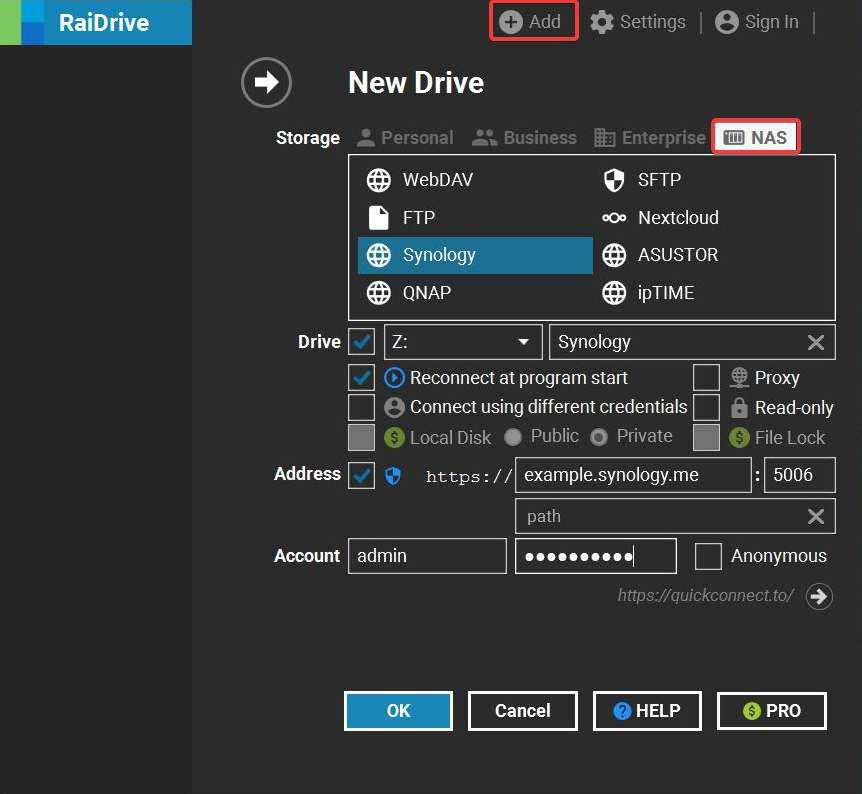
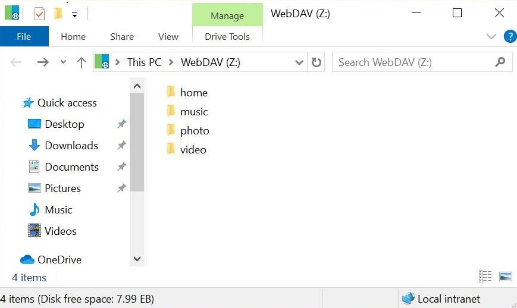
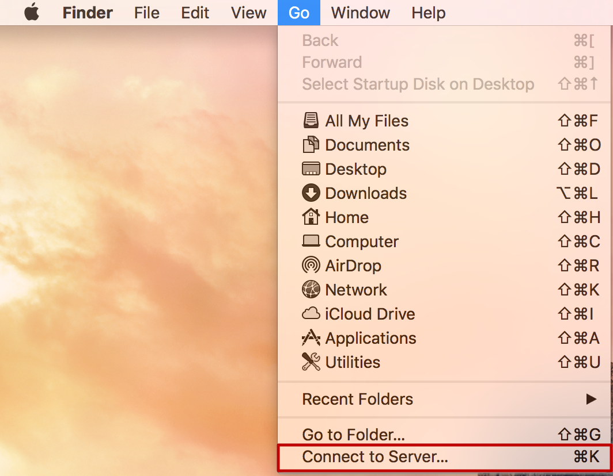
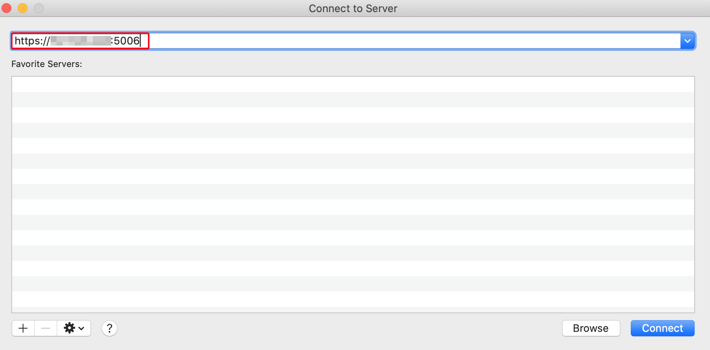
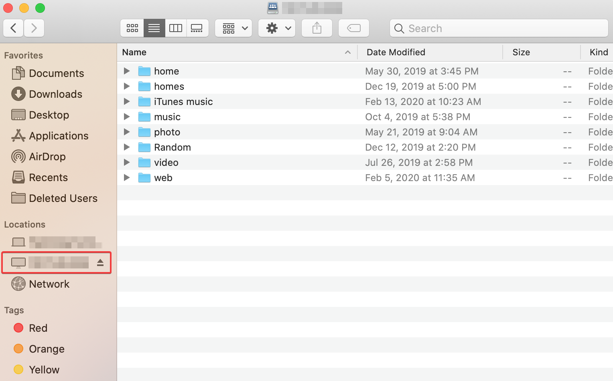
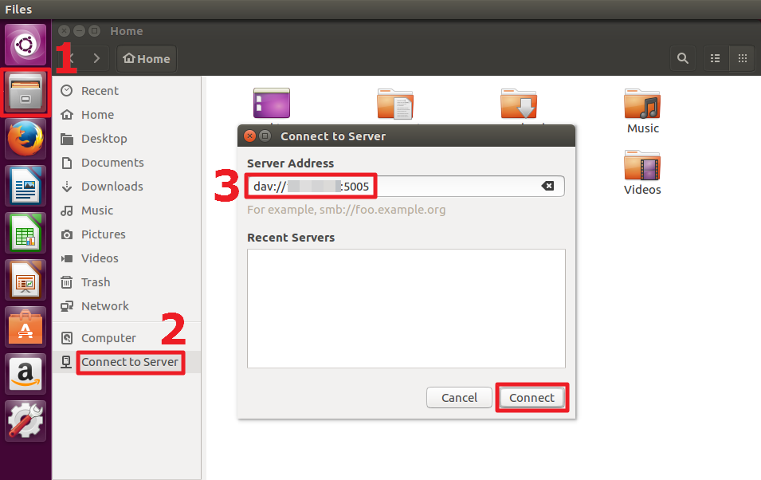

# AIMM Lab NAS 規範

## NAS 使用說明  

1. 本實驗室 NAS 主要用來存放 Datasets、專案資料、結案資料等實驗室相關檔案，請勿將 NAS 直接當成自己的私人雲端備份空間
2. NAS 是 Mount 在 Server `/nas` 路徑下的一個硬碟空間 (容量 18T HDD)
3. NAS 分為兩個大的資料夾，分別是 `/queue` & `/datasets`
    + `/nas/queue` 是暫存用戶的 datasets 申請，使用者可以先將想申請的 dataset 放置於此資料夾下
    + 若此次申請經管理員核准，即可移至 `/datasets` 資料夾，作為本實驗室之共用資料集

## NAS 使用方法

1. `/datasets` `/queue` 存取共用資料集

    1. 將現有 datasets 填寫表單(問卷形式)，管理員根據申請項目填寫至 Queue，表單連結為 (待公告！現在請先直接告知管理員)
    2. 待申請通過，用戶可自行將資料集轉移到 `/nas/datasets/<dataset-folder>`  

2. `/projects` 專案雲端 (多人參與專案時，共享資料的空間，可以放置簡報、程式碼、錄影等) (記得向管理員告知)
3. `/backups` 實驗室重要資料備份空間 (記得向管理員告知)

## NAS 操作 (Server)

使用者在 Server 上的帳號皆位於 `/mnt/data0/<user-name>`，而 NAS 資料夾位於和前述的 `/mnt` 資料夾同一層級的位置，切換路徑用以下指令 `cd /nas`，即可找到 NAS 資料夾 (不分 3090 或是 2080Tis Server，兩者皆一樣)

```diff
! 大家也可以嘗試將大型資料集，如 ImageNet-1k, CityScape 等，放到 NAS
! 管理員實測不論是將資料集放在 SSD 或是 NAS 上，訓練速度都不會有太大差異 (BottleNeck 在顯卡上)。
! 如果發現速度上明顯變慢的話，再請告知管理員做網路優化。
```

將 dataset 資料集移入 NAS 操作示範影片 : https://www.youtube.com/watch?v=RcFUuDqtkho

1. `pwd`：查看當前路徑，如 `mnt/data0/user_name`  
2. `cp -R <folder-name> /nas/queue`：將資料集複製到 `/nas/queue` 
3. `cd /nas`：進入 NAS 資料夾
4. `ls`：查看 NAS 內是否出現資料集，順利複製一份到 `/nas/queue`

## NAS PC 映射

NAS 已經開啟 WebDAV 功能，使用者可以將 NAS 直接映射到自己電腦，，以一視覺化界面預覽或處理 NAS 上資料。

官方教學：https://kb.synology.com/zh-hk/DSM/tutorial/How_to_access_files_on_Synology_NAS_with_WebDAV (不知道為啥直接按下去連結會跳到 403，有興趣想看官方教學的可以複製再貼上，就會正常了XD)

適合將專案共享的資料夾 (`/projects`) 映射到自己電腦，隨時觀看共享文件，再也不用擔心 Google 雲端空間不構的問題 (也不會有 NCTU 帳號畢業後空間被砍的問題 QQ)。

### Windows

1. 下載 [RaiDrive](https://www.raidrive.com/)
2. 開啟 RaiDrive，新增硬碟映射資訊
    + Storage：點選 NAS 選單下的 Synology
    + Drive：選擇要映射的硬碟代號以及名稱 (圖例為 Synology 名稱的 Z 槽)
    + Address：`https://140.113.228.124:5006`，path 留白即可
    + Account：帳號 `lab-members`，密碼 `ED206aimm` (請別外傳XD)

    
3. 映射完畢，NAS 資料可以像一般資料夾一樣直接存取 (存取速度取決於網路速度)
    

### MACs

1. 開啟 Finder 網路映射的功能介面
    
2. 輸入映射網址，並輸入帳密
    + Address：`https://140.113.228.124:5006`
    + Account：帳號 `lab-members`，密碼 `ED206aimm` (請別外傳XD)

    

3. 映射完畢，NAS 資料可以像一般資料夾一樣直接存取 (存取速度取決於網路速度)

    

### Linux

1. 開啟檔案管理員
2. 點選 `Connect to Server`
3. 輸入映射網址，並輸入帳密
    + Address：`https://140.113.228.124:5006`
    + Account：帳號 `lab-members`，密碼 `ED206aimm` (請別外傳XD)



## NAS Rules

1. Server 一個帳號不得超過 100 G (master 帳號可用 300G)，指的是 SSD ; 換言之帳號未超過容量, 可以不用放 NAS (但常用資料集，如 ImageNet, COCO 等建議直接用 NAS 內，避免重複資料集占用硬碟空間)。
2. `/queue` 為公用資料夾，請勿隨意更改資料  
3. 請申請再將 datasets 放置 `/queue`，若申請單上沒有該筆對應資料，管理員會直接移除
4. 目前 NAS 管理員：林哲豪，有問題請私訊或直接 Tag 他

